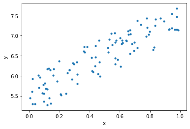
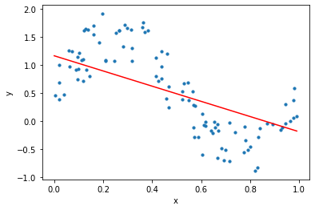

## DeZeroの使い方
### 関数の最小値(勾配降下法)
　次の式で，$z$の最小値となる$x$と$y$を求める($x,y$は実数)．
$$
z = (x-2)^2 + (y-3)^2
$$
$z=x^2+y^2$のグラフの形が[こちら](https://www.geogebra.org/3d/dfrzwv6g)であるため，
これを$x$軸正の方向に$2$，$y$軸正の方向に$3$だけ平行移動させたものがこのグラフの形である．

次のコードで，$x$と$y$の初期値を$0$として，`z.backward()`をしたあとに，`x.grad`と`y.grad`を表示する．これは何を表しているのか．
```python
import numpy as np
from dezero import Variable

def f(x,y):
    z = (x-2)**2 + (y-3)**2
    return z

x = Variable(np.array(0.0))
y = Variable(np.array(0.0))

z = f(x,y)
z.backward()
print(x, y, z)
print(x.grad, y.grad)
```
```python
variable(0.0) variable(0.0) variable(13.0)
variable(-4.0) variable(-6.0)
```
`backward`メソッドでは，$z$の各変数についての偏微分を計算している．この場合は，次のようになる．
$$
\frac{\partial z}{\partial x} = 2(x-2) = 2x-4
$$
$$
\frac{\partial z}{\partial y} = 2(y-3) = 2y-6
$$
そして，gradは，変数がその値であるときの偏微分を表している．
$$
\frac{\partial z}{\partial x} (0,0) = -4 
$$
$$
\frac{\partial z}{\partial y} (0,0) = -6
$$

偏微分の図形的な意味は勾配(gradient)である．点$(0,0)$から，これらの偏微分をベクトルとして表した$(-4,-6)$の方向に移動すると，$z$の値が最も大きくなる．これを勾配ベクトルと呼び，次のように記号$\nabla$で表す．
$$
\nabla z = \left( \frac{\partial z}{\partial x}, \frac{\partial z}{\partial y} \right) = \left( -4, -6 \right)
$$
まとめると，勾配ベクトル$\nabla z(x,y)$は，次の意味を持つ(証明[^1])．
- $(x,y)$からちょっと動いたときに，$z$の値が最も大きくなる方向を示す．
- その方向に，$C$だけ動くと，$z$の値が$C||\nabla z||$くらい増える．
    - $||\nabla z||$は勾配ベクトルの大きさである．

この性質を利用すると，できるだけ小さい値$z$を求めるためには，$z$の勾配ベクトルの逆の方向に少し動くことを繰り返せば良いと考えられる．この手法を勾配降下法と呼ぶ．

これをDeZeroで実装すると，次のようになる．
```python
import numpy as np
from dezero import Variable

def f(x,y):
    z = (x-2)**2 + (y-3)**2
    return z


x = Variable(np.array(0.0))
y = Variable(np.array(0.0))

lr = 0.001 # learning rate
n = 10000 # iteration

for i in range(n):
    z = f(x,y)
    #print(x, y, z)

    x.cleargrad()
    y.cleargrad()
    z.backward()

    x.data -= lr * x.grad.data
    y.data -= lr * y.grad.data

print(x, y)
```
```
variable(1.9999999959594266) variable(2.9999999939391397)
```
注意するべきは，
- `x.cleargrad()`と`y.cleargrad()`で，`x.grad`と`y.grad`を初期化している．
- `x.grad`ではなく`x.grad.data`を使っている．
    - `x.grad`が整数型ではなく，`Variable`という型であるため．

[^1]:https://manabitimes.jp/math/1237

### 線形回帰
#### 問題設定
　$y=ax+b$のような線形関数で，与えられた点$(x_i,y_i)$の集合を「最もよく近似する」$a$と$b$を求める問題を線形回帰と呼ぶ．まず，次のようなデータセットで試す．
```python
import numpy as np
import matplotlib.pyplot as plt
from dezero import Variable
import dezero.functions as F

# トイ・データセット
np.random.seed(0)
x = np.random.rand(100, 1)
y = 5 + 2 * x + np.random.rand(100, 1)
x, y = Variable(x), Variable(y)  # 省略可能

# Plot
plt.scatter(x.data, y.data, s=10)
plt.xlabel('x')
plt.ylabel('y')
plt.show()
```


人間の感覚により，なんとなく真ん中に直線が引けそうなことはわかる．

　問題となるのが，何をもって「最もよく近似している」直線であると判断するかである．これは，いくつかの指標が考えられる．今回は，次の式で表される「平均二乗誤差」(mean squared error)を用いる．
$$
L = \frac{1}{N} \sum_{i=1}^N (y_i - (ax_i + b))^2
$$
この値が小さいほど，直線がデータに近似しているということにする．このような予測したパラメータの悪さを表す指標を損失関数(loss function)と呼ぶ．

#### 実装
　複数の点$(x_i,y_i)$があるが，これをまとめて一つの変数として扱うために，行列を用いる．
$y=ax+b$の式を行列で表すと，次のようになる．行列を扱うことのできるライブラリを使うと，簡単に計算ができる．
$$
\begin{pmatrix}
y_1 \\\\
y_2 \\\\
\vdots \\\\
y_N
\end{pmatrix}
\=
a
\begin{pmatrix}
x_1  \\\\
x_2  \\\\
\vdots \\\\
x_N 
\end{pmatrix}
+
\begin{pmatrix}
b \\\\
b \\\\
\vdots \\\\
b
\end{pmatrix}
$$
一次関数の計算を`predict`関数で行うとすれば，次のようになる．ここでは，$a$の代わりにWで実装している．
```python
import matplotlib.pyplot as plt
from dezero import Variable
import dezero.functions as F

np.random.seed(0)
x = np.random.rand(100, 1)
y = 5 + 2 * x + np.random.rand(100, 1)

W = Variable(np.zeros((1, 1)))
b = Variable(np.zeros(1))

def predict(x):
    y = F.matmul(x, W) + b
    return y
```
また，numpyの機能を使うと損失関数は次のように実装できる．
```python
def mean_squared_error(x0, x1):
    diff = x0 - x1
    return F.sum(diff ** 2) / len(diff)
```
あとは，損失関数上での勾配ベクトルを求め，パラメータを更新するだけである．

勘違いをしがちなのが，次の点だ．
- $x_1,x_2,\dots,x_N,y_1,y_2,\dots,y_N$は，変数ではなく**定数である**．
- 変数であるのは，$y=ax+b$における$a$と$b$のみである．
- つまり，損失関数は，$a$と$b$の関数である．その損失関数は，係数や定数項に$x_i,y_i$がたくさん入っている複雑な関数である．

### 非線形なデータ
　この世の全てのデータが線形の関係にあるわけではない．$y=\sin x$のような非線形なデータに対して，線形な関数を使って予測すると，次のような結果になる．



三角関数に準じたデータであるが，線形の形で近似するとなんともアバウトな結果になる．

　ここでニューラルネットワークの概念が登場する．ニューラルネットワークは，線形な関数(線形変換，あるいはアフィン変換)と非線形な関数(**活性化関数**と呼ばれる)を組み合わせることで，非線形な関数を表現することができる．
　活性化関数の例としては，シグモイド関数やReLU関数などがある．
$$
\begin{align*}
\text{シグモイド関数} \quad &\sigma(x) = \frac{1}{1 + \exp(-x)} \\\\
\text{ReLU関数} \quad &\text{ReLU}(x) = \max(0, x)
\end{align*}
$$
DeZeroでは，これらの関数は`dezero.functions`に実装されている．線形関数も`F.linear`で実装されている．さっきのコード`F.matmul(x, W) + b`は，`F.linear(x, W, b)`と書き換えられる．今回は，線形関数，シグモイド関数，線形関数の3つの層を組み合わせる．
```python
I, H, O = 1, 10, 1
W1, b1 = Variable(0.01 * np.random.randn(I, H)), Variable(np.zeros(H))
W2, b2 = Variable(0.01 * np.random.randn(H, O)), Variable(np.zeros(O))

def predict(x):
    y = F.linear(x, W1, b1)
    y = F.sigmoid(y)
    y = F.linear(y, W2, b2)
    return y
```
各層で起こっていることを順に説明をする．入力と出力の次元はそれぞれ1と1である．中間層(隠れ層)の次元は10とする．
- 第$1$層．入力は$1$次元で，$10$次元の$W$と$b$を用いて線形変換され，$y_1,y_2,y_3,\cdots,y_{10}$が得られる．

$$
\begin{pmatrix}
y_1 & y_2 & \cdots & y_{10}
\end{pmatrix}
\=
\begin{pmatrix}
x
\end{pmatrix}
\begin{pmatrix}
w_{1} & w_{2} & \cdots & w_{10}
\end{pmatrix}
+
\begin{pmatrix}
b_{1} & b_{2} & \cdots & b_{10} 
\end{pmatrix}
$$

- 次に，第$2$層目で，$y_1,y_2,y_3,\cdots,y_{10}$をそれぞれシグモイド関数に入力する．
$$
y_1 \leftarrow \sigma(y_1) \\\\
y_2 \leftarrow \sigma(y_2) \\\\
\vdots \\\\
y_{10} \leftarrow \sigma(y_{10})
$$
- 最後に，第$3$層目で，$y_1,y_2,y_3,\cdots,y_{10}$をそれぞれ線形変換する．

$$
\begin{pmatrix}
y
\end{pmatrix}
\=
\begin{pmatrix}
y_1 & y_2 & \cdots & y_{10}
\end{pmatrix}
\begin{pmatrix}
w_1 \\\\
w_2 \\\\
\vdots \\\\
w_{10}
\end{pmatrix}
+
\begin{pmatrix}
b
\end{pmatrix}
$$

注意するべきは，数式で$x$はスカラー量のように見えているが，実際は，`x = np.random.rand(100, 1)`のような行列であることである(この場合$100$行$1$列の行列)．

最終的には次のようなコードになる．
```python
import numpy as np
import matplotlib.pyplot as plt
from dezero import Variable
import dezero.functions as F

# トイ・データセット
np.random.seed(0)
x = np.random.rand(100, 1)
y = np.sin(2 * np.pi * x) + np.random.rand(100, 1)
x, y = Variable(x), Variable(y)  # 省略可能

I, H, O = 1, 10, 1
W1, b1 = Variable(0.01 * np.random.randn(I, H)), Variable(np.zeros(H))
W2, b2 = Variable(0.01 * np.random.randn(H, O)), Variable(np.zeros(O))

def predict(x):
    y = F.linear(x, W1, b1)
    y = F.sigmoid(y)
    y = F.linear(y, W2, b2)
    return y

def mean_squared_error(x0, x1):
    diff = x0 - x1
    return F.sum(diff ** 2) / len(diff)

lr = 0.2
iters = 10000

for i in range(iters):
    y_pred = predict(x)
    loss = mean_squared_error(y, y_pred)

    W1.cleargrad()
    b1.cleargrad()
    W2.cleargrad()
    b2.cleargrad()
    loss.backward()

    W1.data -= lr * W1.grad.data
    b1.data -= lr * b1.grad.data
    W2.data -= lr * W2.grad.data
    b2.data -= lr * b2.grad.data

    if i % 10 == 0:
        print(loss.data)


# Plot
plt.scatter(x.data, y.data, s=10)
plt.xlabel('x')
plt.ylabel('y')
t = np.arange(0, 1, .01)[:, np.newaxis]
y_pred = predict(t)
plt.plot(t, y_pred.data, color='r')
plt.show()
```